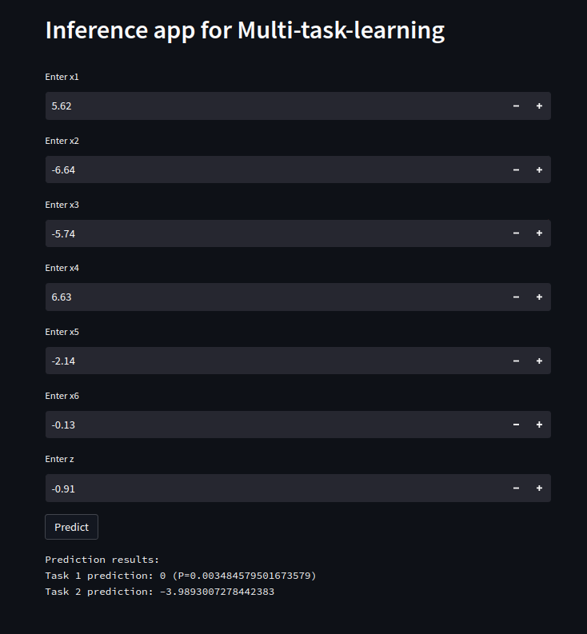

# Multi-task-learning

## Overview
Multi-task learning project, where the main task has very little data, 
but the auxiliary task has a lot of data. The expectation is that the data 
from the second task will generalise the model well and then a small amount 
of data from the first task will be sufficient to train the network and avoid 
the overfiting problem. The main task is binary classification, the auxiliary 
task is regression.

Details about model architecture and training are presented in `./notebooks/train_model.ipynb`


## Prerequisites 
1. Framework: Python 3.8
2. Operating system: Ubuntu (this app wasn't tested on any different OS)

### Virtualenv

To install it, run:
```
# Get the latest version
pip install virtualenv
```

To create a virtual environemnt in the local file system the syntax is:
```
virtualenv --python <python version> <name of environment> 
```

For example, to create an empty Python 3.8 environment: 
```
virtualenv --python 3.8 mtl_project
```

## Activating and populating the environment with packages

To activate the created empty environment, use the command: 
```
source mtl_project/bin/activate
```

### Install requirments
Installing the necesary packages:
```
pip install -r requirements.txt
```

## Run model training

From command line in a root project directory
```
python3 -m run_training
```
Another way is to open `train_model.ipynb` that is located in *./notebooks* directory and run that notebook code.

## Inference
For inference, a streamlit application is created where input values are given and a prediction 
is returned by clicking "predict".  
**Note: the streamlit application uses the last model you trained**

Run from command line in a root project directory
```
streamlit run app.py 
```



# Further improvements
This model is made for learning purposes, so it is one of the simpler versions with a basic functionality, possible improvements:
1. Write custom loss functions for each task
2. Write a custom training step function and adaptively change the learning rate during training
3. Fine tune model hyperparamters
4. Adaptively change the loss weights for each task depending on the epoch, e.g. start with a higher loss weight in task 2 and a lower loss weight in task 1 and gradually change the ratio, i.e. decrease the loss weight of task 2 and increase the loss weight of task 1. In this way, the model could generalize better
5. Refactor the training pipeline so that the training parameters can be passed via a config file, that would give more control over model parameters
6. Try upsampling techniques for task 1 dataset (e.g. SMOTE)


## Current model architecture:

